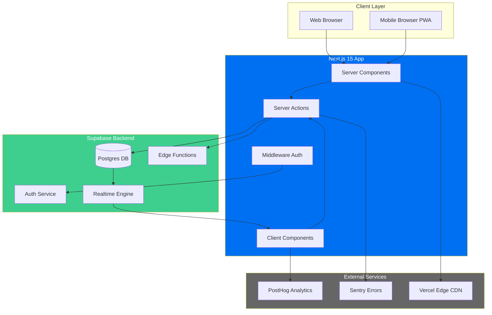

# Job Cost Budget Web Application - Product Requirements Document (PRD)
**Version 2.0 - Improved Architecture**
**Last Updated:** January 2025
**Owner:** King Flowers

---

## Table of Contents
1. [Executive Summary](#executive-summary)
2. [Product Vision & Goals](#product-vision--goals)
3. [User Personas & Use Cases](#user-personas--use-cases)
4. [Technical Architecture](#technical-architecture)
5. [Feature Specifications](#feature-specifications)
6. [Implementation Roadmap](#implementation-roadmap)
7. [Security & Compliance](#security--compliance)
8. [Success Metrics & Analytics](#success-metrics--analytics)

---

## 1. Executive Summary

### Product Overview
A modern, full-stack SaaS application for construction professionals to create, track, and manage detailed renovation budgets with real-time variance analysis, material cost tracking, and labor hour calculations.

### Core Value Proposition
- **Speed:** Create comprehensive budgets in minutes, not hours
- **Accuracy:** Real-time variance tracking prevents cost overruns
- **Mobility:** Mobile-first design for field updates by foremen
- **Insights:** Visual dashboards with category breakdowns and trend analysis
- **Integration:** Future QuickBooks sync for seamless invoicing

### Target Market
- Small to medium construction companies (5-50 employees)
- Independent contractors managing renovation projects
- Project managers tracking multiple job sites
- Initial focus: Residential renovation projects ($50k-$500k range)

---

## 2. Product Vision & Goals

### Business Objectives
1. **MVP Launch (Month 3):** Ship core budgeting features to 10 beta users
2. **Revenue (Month 6):** Convert 50 paying customers at $29/mo
3. **Scale (Month 12):** Support 500+ users with 95% uptime
4. **Expansion (Month 18):** Add commercial construction features

### User Outcomes
- **30% reduction** in budget variance through real-time tracking
- **5x faster** budget creation vs. Excel/Google Sheets
- **90% mobile adoption** for field updates (foremen logging actuals)
- **Zero data loss** with automatic cloud sync

### Success Criteria
- User can create 10-item budget in < 5 minutes
- Mobile budget update completes in < 10 seconds
- Variance alerts trigger within 1 minute of threshold breach
- 99.5% uptime SLA on Vercel infrastructure

---

## 3. User Personas & Use Cases

### Primary Persona: Project Manager (Sarah)
- **Background:** Manages 3-5 renovation projects simultaneously
- **Pain Points:** Excel budgets get out of sync, can't track actuals in real-time
- **Goals:** Know job profitability instantly, catch overruns early
- **Use Cases:**
  - Creates new budget from template (kitchen reno with standard scope)
  - Imports CSV of line items from estimating software
  - Reviews dashboard showing all jobs with variance alerts
  - Exports finalized budget to PDF for client approval

### Secondary Persona: Field Foreman (Mike)
- **Background:** Leads crew, tracks daily material/labor usage
- **Pain Points:** Paper timesheets, delayed expense reporting
- **Goals:** Log actuals from job site, update PM immediately
- **Use Cases:**
  - Opens mobile app at 7 AM, logs crew hours by task
  - Scans receipt for emergency lumber purchase, adds to budget
  - Sees real-time variance alert: "Electrical 15% over budget"
  - Marks scope item complete: "Install gutters - DONE"

### Tertiary Persona: Business Owner (Tom)
- **Background:** Owns company, reviews financial health weekly
- **Pain Points:** Can't see aggregate profitability across jobs
- **Goals:** Portfolio-level insights, QuickBooks integration
- **Use Cases:**
  - Views company dashboard: all active jobs, total variance
  - Exports monthly report for accountant
  - Sets up automated QuickBooks sync (post-MVP)

---

## 4. Technical Architecture

### 4.1 Technology Stack (Improved)

#### Frontend
- **Next.js 15** (App Router, TypeScript, React 19)
  - **Why:** Hybrid SSR/SSG for fast dashboards, built-in API routes, edge optimization
  - **Key Features:** Server Components for secure data fetching, Server Actions for mutations
  - **Performance:** Turbopack for 100x faster dev builds, streaming suspense for UX

- **TailwindCSS v4** + **Shadcn/ui**
  - **Why:** Utility-first consistency, microsecond rebuilds (v4), accessible components
  - **Components:** DataTable, Form, Charts, Dialog, Command palette
  - **Customization:** CSS variables for theming (light/dark mode)

#### State Management
- **React Server Components** + **React Query** (TanStack Query v5)
  - **Why:** Server Components eliminate most client state needs
  - **React Query for:** Optimistic updates, caching, background refetching
  - **Local State:** React Context only for UI state (theme, sidebar toggle)
  - **Removed:** Zustand (unnecessary complexity for this use case)

#### Backend & Database
- **Supabase** (Postgres 15 + Auth + Realtime)
  - **Database:** Postgres with Row-Level Security (RLS) for multi-tenant isolation
  - **Authentication:** Email/password + magic links, social OAuth (Google) post-MVP
  - **Realtime:** WebSocket subscriptions for live budget updates (multi-user collaboration)
  - **Edge Functions:** Heavy calculations (variance aggregation) run near DB

- **Next.js Server Actions**
  - **Why:** Type-safe mutations without API boilerplate, progressive enhancement
  - **Use Cases:** `createJob`, `addScopeItem`, `updateActualCost`, `calculateVariance`

#### Integrations (Phased)
- **MVP:** CSV import/export (no external integrations)
- **Post-MVP (Month 4):** QuickBooks Online API for invoice sync
- **Post-MVP (Month 5):** Email notifications via Resend
- **Post-MVP (Month 6):** PDF report generation via Puppeteer/React-PDF

#### DevOps & Tooling
- **Deployment:** Vercel (auto-deploy from `main` branch)
- **Version Control:** GitHub with branch protection (require PR reviews)
- **CI/CD:** GitHub Actions (type-check, lint, Playwright tests on PR)
- **Monitoring:**
  - PostHog (product analytics, funnel tracking)
  - Sentry (error tracking, performance monitoring)
  - Vercel Analytics (Web Vitals, edge latency)
- **Design:** Figma for wireframes, Storybook for component library (optional)

### 4.2 Database Schema (Improved)

```sql
-- Jobs table (main entity)
CREATE TABLE jobs (
  id UUID PRIMARY KEY DEFAULT gen_random_uuid(),
  user_id UUID REFERENCES auth.users(id) ON DELETE CASCADE NOT NULL,
  name TEXT NOT NULL,
  client_name TEXT,
  address TEXT,
  status TEXT DEFAULT 'active' CHECK (status IN ('active', 'completed', 'archived')),
  created_at TIMESTAMPTZ DEFAULT NOW(),
  updated_at TIMESTAMPTZ DEFAULT NOW()
);

-- Budget versions (immutable for audit trail)
CREATE TABLE budget_versions (
  id UUID PRIMARY KEY DEFAULT gen_random_uuid(),
  job_id UUID REFERENCES jobs(id) ON DELETE CASCADE NOT NULL,
  version INT NOT NULL,
  notes TEXT,
  created_at TIMESTAMPTZ DEFAULT NOW(),
  created_by UUID REFERENCES auth.users(id),
  UNIQUE(job_id, version)
);

-- Categories (standardized for reporting)
CREATE TABLE categories (
  id UUID PRIMARY KEY DEFAULT gen_random_uuid(),
  name TEXT UNIQUE NOT NULL,
  sort_order INT,
  color TEXT -- Hex color for UI
);

-- Scope items (budget line items)
CREATE TABLE scope_items (
  id UUID PRIMARY KEY DEFAULT gen_random_uuid(),
  budget_version_id UUID REFERENCES budget_versions(id) ON DELETE CASCADE NOT NULL,
  category_id UUID REFERENCES categories(id),
  description TEXT NOT NULL,

  -- Estimated costs
  estimated_material_cost NUMERIC(10,2) DEFAULT 0 CHECK (estimated_material_cost >= 0),
  estimated_labor_hours NUMERIC(7,2) DEFAULT 0 CHECK (estimated_labor_hours >= 0),
  estimated_labor_rate NUMERIC(8,2) DEFAULT 50.00,

  -- Actual costs
  actual_material_cost NUMERIC(10,2) DEFAULT 0 CHECK (actual_material_cost >= 0),
  actual_labor_hours NUMERIC(7,2) DEFAULT 0 CHECK (actual_labor_hours >= 0),

  -- Metadata
  is_completed BOOLEAN DEFAULT FALSE,
  completed_at TIMESTAMPTZ,
  notes TEXT,
  created_at TIMESTAMPTZ DEFAULT NOW(),
  updated_at TIMESTAMPTZ DEFAULT NOW()
);

-- Indexes for performance
CREATE INDEX idx_jobs_user ON jobs(user_id, created_at DESC);
CREATE INDEX idx_budget_versions_job ON budget_versions(job_id, version DESC);
CREATE INDEX idx_scope_items_budget ON scope_items(budget_version_id);
CREATE INDEX idx_scope_items_category ON scope_items(category_id);

-- Row-Level Security (RLS) policies
ALTER TABLE jobs ENABLE ROW LEVEL SECURITY;
ALTER TABLE budget_versions ENABLE ROW LEVEL SECURITY;
ALTER TABLE scope_items ENABLE ROW LEVEL SECURITY;

-- Users can only see their own jobs
CREATE POLICY "Users see own jobs" ON jobs
  FOR ALL USING (user_id = auth.uid());

-- Users can access budget versions for their jobs
CREATE POLICY "Users access own budget versions" ON budget_versions
  FOR ALL USING (
    job_id IN (SELECT id FROM jobs WHERE user_id = auth.uid())
  );

-- Users can access scope items for their budgets
CREATE POLICY "Users access own scope items" ON scope_items
  FOR ALL USING (
    budget_version_id IN (
      SELECT bv.id FROM budget_versions bv
      JOIN jobs j ON j.id = bv.job_id
      WHERE j.user_id = auth.uid()
    )
  );

-- Postgres functions for calculations
CREATE OR REPLACE FUNCTION calculate_variance(scope_item_id UUID)
RETURNS NUMERIC AS $$
  SELECT
    (actual_material_cost + (actual_labor_hours * estimated_labor_rate)) -
    (estimated_material_cost + (estimated_labor_hours * estimated_labor_rate))
  FROM scope_items
  WHERE id = scope_item_id;
$$ LANGUAGE SQL STABLE;

CREATE OR REPLACE FUNCTION calculate_budget_totals(budget_version_uuid UUID)
RETURNS TABLE(
  total_estimated NUMERIC,
  total_actual NUMERIC,
  total_variance NUMERIC,
  variance_percentage NUMERIC
) AS $$
  SELECT
    SUM(estimated_material_cost + (estimated_labor_hours * estimated_labor_rate)) AS total_estimated,
    SUM(actual_material_cost + (actual_labor_hours * estimated_labor_rate)) AS total_actual,
    SUM(actual_material_cost + (actual_labor_hours * estimated_labor_rate)) -
      SUM(estimated_material_cost + (estimated_labor_hours * estimated_labor_rate)) AS total_variance,
    CASE
      WHEN SUM(estimated_material_cost + (estimated_labor_hours * estimated_labor_rate)) > 0
      THEN (SUM(actual_material_cost + (actual_labor_hours * estimated_labor_rate)) -
            SUM(estimated_material_cost + (estimated_labor_hours * estimated_labor_rate))) /
            SUM(estimated_material_cost + (estimated_labor_hours * estimated_labor_rate)) * 100
      ELSE 0
    END AS variance_percentage
  FROM scope_items
  WHERE budget_version_id = budget_version_uuid;
$$ LANGUAGE SQL STABLE;
```

### 4.3 Architecture Diagram



### 4.4 Data Flow (Create Budget Example)

1. **User Action:** Sarah clicks "New Budget" → enters job details (name, client, address)
2. **Frontend:** Next.js Server Component renders form with Shadcn `<Form>` + React Hook Form + Zod validation
3. **Submission:** Form calls Server Action `createJobAction(formData)`
4. **Server Action:**
   ```typescript
   'use server'
   export async function createJobAction(formData: FormData) {
     const supabase = createServerClient() // SSR client with auth
     const userId = (await supabase.auth.getUser()).data.user?.id

     const { data, error } = await supabase
       .from('jobs')
       .insert({
         name: formData.get('name'),
         client_name: formData.get('client'),
         user_id: userId
       })
       .select()
       .single()

     if (error) throw error
     revalidatePath('/dashboard')
     return { jobId: data.id }
   }
   ```
5. **Database:** Supabase inserts row, RLS checks `user_id = auth.uid()`, returns new job
6. **Realtime:** Supabase broadcasts `INSERT` event via WebSocket
7. **UI Update:** React Query invalidates cache, refetches job list, optimistic update shows new job
8. **Analytics:** PostHog captures `job_created` event with metadata

---

## 5. Feature Specifications

### 5.1 MVP Features (Month 1-3)

#### 5.1.1 User Authentication
- **Email/Password Signup:** Supabase Auth with email confirmation
- **Login:** Email/password with "Remember me" (refresh token)
- **Password Reset:** Magic link sent via email
- **Protected Routes:** Middleware redirects unauthenticated users to `/login`
- **Session Management:** Auto-refresh tokens, logout clears cookies

**Acceptance Criteria:**
- [ ] User can sign up with email/password in < 30 seconds
- [ ] Email confirmation required before first login
- [ ] Password reset link expires in 1 hour
- [ ] Session persists across browser restarts (if "Remember me")

#### 5.1.2 Job Management
- **Create Job:** Form with fields (name, client, address, start date)
- **List Jobs:** Dashboard table with columns (name, client, status, variance %, last updated)
- **View Job Details:** Dedicated page with budget versions, scope items, charts
- **Edit Job:** Update metadata (name, address), archive completed jobs
- **Delete Job:** Soft delete (archive) with confirmation modal

**Acceptance Criteria:**
- [ ] Create job in < 2 minutes with inline validation
- [ ] Job list loads in < 1 second (server-rendered with streaming)
- [ ] Search/filter jobs by client name or status
- [ ] Cannot delete job with active budget (must archive first)

#### 5.1.3 Budget Creation & Management
- **Create Budget Version:** Auto-increments version (v1, v2, v3) for same job
- **Add Scope Items:** Inline form in table (description, category, estimated costs)
- **Bulk Import:** CSV upload with column mapping (description → category → costs)
- **Edit Scope Items:** Inline editing with optimistic updates
- **Delete Scope Items:** Soft delete with undo toast notification
- **Category Management:** Predefined categories (Demo, Framing, Electrical, Plumbing, etc.)

**Acceptance Criteria:**
- [ ] Add 10 scope items in < 2 minutes
- [ ] CSV import processes 100 rows in < 5 seconds
- [ ] Optimistic update shows immediately, rollback on error
- [ ] Categories color-coded in UI (e.g., Electrical = blue)

#### 5.1.4 Cost Tracking & Calculations
- **Estimated Costs:**
  - Material cost (user input)
  - Labor hours × labor rate = labor cost
  - Subtotal per item = material + labor
- **Actual Costs:**
  - Foreman updates actual material/labor in mobile form
  - Variance auto-calculated: `actual - estimated`
- **Overhead & Profit:**
  - Configurable percentages (default 10% overhead, 15% profit)
  - Applied to subtotal: `subtotal × (1 + overhead% + profit%)`
- **Budget Totals:**
  - Sum all scope items
  - Display: Estimated Total, Actual Total, Variance ($), Variance (%)

**Formulas:**
```typescript
// Per scope item
const laborCost = laborHours * laborRate
const estimatedTotal = materialCost + laborCost
const actualTotal = actualMaterialCost + (actualLaborHours * laborRate)
const variance = actualTotal - estimatedTotal
const variancePercent = (variance / estimatedTotal) * 100

// Budget level
const subtotal = sum(scopeItems.map(i => i.estimatedTotal))
const overhead = subtotal * overheadPercent
const profit = subtotal * profitPercent
const grandTotal = subtotal + overhead + profit
```

**Acceptance Criteria:**
- [ ] Variance updates in < 500ms after actual cost entry
- [ ] Overhead/profit configurable per job (not global)
- [ ] Negative variance shown in green (under budget)
- [ ] Positive variance > 10% triggers alert (yellow badge)

#### 5.1.5 Dashboard & Reporting
- **Job Overview Cards:** Total jobs, active jobs, avg variance
- **Recent Activity Feed:** "Mike updated Electrical costs on Job #123"
- **Variance Chart:** Bar chart showing variance by category (Recharts)
- **Budget Breakdown:** Pie chart of estimated costs by category
- **Export:**
  - CSV export of all scope items
  - Print-friendly budget view (future: PDF generation)

**Acceptance Criteria:**
- [ ] Dashboard loads in < 2 seconds with all charts
- [ ] Charts responsive on mobile (stacked bars, collapsible legend)
- [ ] CSV export includes all fields (description, costs, variance)
- [ ] Print view hides navigation, formats for 8.5×11 paper

#### 5.1.6 Mobile Experience
- **Responsive Design:** Mobile-first with Tailwind breakpoints (sm, md, lg)
- **Touch Optimization:** 44px tap targets, swipe actions (delete item)
- **Offline Indicators:** Show "No connection" banner, queue updates
- **Progressive Web App (PWA):**
  - Install prompt on mobile browsers
  - App icon, splash screen
  - Deferred to post-MVP: Full offline mode with service worker

**Acceptance Criteria:**
- [ ] All pages usable on 375px viewport (iPhone SE)
- [ ] Form inputs have proper mobile keyboards (number pad for costs)
- [ ] No horizontal scroll on any screen size
- [ ] PWA installable on iOS Safari and Android Chrome

### 5.2 Post-MVP Features (Month 4-6)

#### 5.2.1 QuickBooks Integration
- **OAuth Setup:** User connects QuickBooks account
- **Invoice Sync:** Export finalized budget as QuickBooks invoice
- **Expense Import:** Pull actual costs from QuickBooks expenses
- **Webhooks:** Real-time sync when QB data changes

#### 5.2.2 Advanced Features
- **Role-Based Access:** Owner, PM, Foreman roles with different permissions
- **Client Portal:** Share read-only budget link with clients
- **AI Cost Predictions:** ML model suggests estimated costs based on historical data
- **Automated Alerts:** Email/SMS when variance > threshold
- **Budget Templates:** Save common scopes (kitchen reno, bathroom reno)
- **Change Orders:** Track scope changes with approval workflow
- **Photo Attachments:** Upload progress photos to scope items

---

## 6. Implementation Roadmap

### Phase 1: Foundation (Weeks 1-2)
**Goal:** Working development environment with core infrastructure

**Sprint 1.1 (Week 1):**
- [ ] Initialize Next.js 15 project with TypeScript + App Router
- [ ] Set up Tailwind v4 + Shadcn/ui (init components: Button, Form, Table)
- [ ] Configure Supabase project (create project, get API keys)
- [ ] Set up GitHub repo with branch protection + PR template
- [ ] Configure Vercel deployment (preview + production)

**Sprint 1.2 (Week 2):**
- [ ] Implement database schema (run SQL migrations in Supabase)
- [ ] Set up RLS policies + test with SQL queries
- [ ] Seed database with sample categories (Demo, Framing, etc.)
- [ ] Configure Supabase Auth (email provider, redirect URLs)
- [ ] Set up environment variables (`.env.local`, Vercel secrets)

**Deliverable:** Deployed app with login page (no functionality yet)

### Phase 2: Core Features (Weeks 3-6)
**Goal:** CRUD operations for jobs and budgets

**Sprint 2.1 (Week 3):**
- [ ] Build authentication flows (signup, login, logout)
- [ ] Create protected layout with navigation
- [ ] Implement job creation form (Server Action + Zod validation)
- [ ] Build jobs list page (Server Component with Suspense)

**Sprint 2.2 (Week 4):**
- [ ] Build job detail page with tabs (Overview, Budget, Activity)
- [ ] Implement budget version creation
- [ ] Add scope items CRUD (inline table editing)
- [ ] Set up React Query for client-side caching

**Sprint 2.3 (Week 5):**
- [ ] Implement calculation engine (variance, totals)
- [ ] Build real-time updates with Supabase Realtime
- [ ] Add category filtering and search
- [ ] Implement CSV import (parse, validate, insert)

**Sprint 2.4 (Week 6):**
- [ ] Build dashboard with overview cards
- [ ] Add charts (Recharts: variance bar, category pie)
- [ ] Implement CSV export functionality
- [ ] Add error handling + loading states

**Deliverable:** Full budget workflow works end-to-end

### Phase 3: Polish & Launch (Weeks 7-12)
**Goal:** Production-ready MVP with monitoring

**Sprint 3.1 (Week 7-8):**
- [ ] Mobile responsive design (test on real devices)
- [ ] Accessibility audit (WCAG 2.1 AA compliance)
- [ ] PWA setup (manifest, icons, install prompt)
- [ ] Performance optimization (image optimization, code splitting)

**Sprint 3.2 (Week 9-10):**
- [ ] Set up PostHog analytics (track key events)
- [ ] Integrate Sentry error tracking
- [ ] Write Playwright E2E tests (critical paths)
- [ ] User acceptance testing with 3 beta users

**Sprint 3.3 (Week 11-12):**
- [ ] Bug fixes from UAT
- [ ] Documentation (user guide, help center)
- [ ] Deploy to production with monitoring
- [ ] Launch to 10 beta users

**Deliverable:** MVP in production with active users

### Phase 4: Growth (Months 4-6)
**Goal:** Scale to 50+ paying users

- Month 4: QuickBooks integration + email notifications
- Month 5: Role-based access + client portal
- Month 6: AI cost predictions + budget templates

---

## 7. Security & Compliance

### 7.1 Authentication & Authorization
- **Supabase Auth:** Industry-standard JWT tokens with refresh rotation
- **Row-Level Security:** Postgres RLS ensures users only access own data
- **HTTPS Only:** Vercel enforces SSL, HSTS headers enabled
- **CSRF Protection:** Next.js built-in CSRF tokens in Server Actions
- **Rate Limiting:** Upstash Redis (100 requests/min per IP) - post-MVP

### 7.2 Data Protection
- **Encryption at Rest:** Supabase encrypts Postgres with AES-256
- **Encryption in Transit:** TLS 1.3 for all connections
- **Backups:** Daily automated backups (7-day retention), weekly S3 exports
- **Data Retention:** Soft deletes with 30-day recovery window

### 7.3 Input Validation
- **Client-Side:** Zod schemas validate all form inputs
- **Server-Side:** Server Actions re-validate with same Zod schemas
- **SQL Injection:** Supabase client uses parameterized queries
- **XSS Prevention:** React auto-escapes, sanitize user HTML with DOMPurify

### 7.4 Monitoring & Incident Response
- **Error Tracking:** Sentry alerts on errors (Slack integration)
- **Uptime Monitoring:** Vercel Analytics + UptimeRobot (1-min checks)
- **Audit Logs:** Track all budget changes (who, when, what)
- **Incident Playbook:** Documented response for data breach, downtime

### 7.5 Compliance (Future)
- **GDPR Ready:** User data export, right to deletion (implement in Month 4)
- **SOC 2 Type II:** Supabase + Vercel are SOC 2 compliant (inherit controls)
- **Financial Data:** No payment processing (QuickBooks handles invoicing)

---

## 8. Success Metrics & Analytics

### 8.1 Product Metrics (PostHog Events)
- **Activation:** `user_signed_up`, `first_job_created`, `first_budget_created`
- **Engagement:** `scope_item_added`, `actual_cost_updated`, `dashboard_viewed`
- **Retention:** DAU/MAU ratio, weekly active users
- **Feature Adoption:** `csv_imported`, `chart_viewed`, `variance_alert_clicked`

### 8.2 Business Metrics
- **Conversion Funnel:**
  - Signup → First job (target: 80%)
  - First job → 5+ scope items (target: 60%)
  - 5+ items → Actual costs updated (target: 40%)
- **Revenue Metrics (Month 6+):**
  - MRR growth rate (target: 20% MoM)
  - Customer acquisition cost (CAC) < $50
  - Lifetime value (LTV) > $300 (10-month avg subscription)

### 8.3 Technical Metrics (Vercel + Sentry)
- **Performance:**
  - Largest Contentful Paint (LCP) < 2.5s (target: 1.5s)
  - First Input Delay (FID) < 100ms
  - Cumulative Layout Shift (CLS) < 0.1
- **Reliability:**
  - Uptime: 99.5% SLA (max 3.6 hours downtime/month)
  - Error rate < 0.5% of requests
  - P95 API response time < 500ms

### 8.4 User Satisfaction
- **NPS Survey:** Quarterly survey (target NPS > 50)
- **Support Tickets:** < 5% of users submit tickets/month
- **Feature Requests:** Track in GitHub Issues, prioritize by votes

---

## Appendices

### A. Tech Stack Summary
```json
{
  "frontend": {
    "framework": "Next.js 15",
    "language": "TypeScript 5.3",
    "styling": "TailwindCSS v4",
    "components": "Shadcn/ui",
    "forms": "React Hook Form + Zod",
    "charts": "Recharts",
    "state": "React Query + Server Components"
  },
  "backend": {
    "database": "Supabase Postgres 15",
    "auth": "Supabase Auth",
    "realtime": "Supabase Realtime",
    "api": "Next.js Server Actions"
  },
  "devops": {
    "hosting": "Vercel",
    "cicd": "GitHub Actions",
    "monitoring": ["PostHog", "Sentry", "Vercel Analytics"],
    "version_control": "GitHub"
  },
  "future_integrations": {
    "accounting": "QuickBooks Online API",
    "email": "Resend",
    "pdf": "React-PDF",
    "ai": "OpenAI GPT-4 (cost predictions)"
  }
}
```

### B. Cost Projections
| Service | Free Tier | Month 1-3 | Month 6 (50 users) | Month 12 (500 users) |
|---------|-----------|-----------|-------------------|----------------------|
| Supabase | 500MB DB | $0 | $25 (Pro) | $25 (Pro) |
| Vercel | 100GB bandwidth | $0 | $20 (Pro) | $150 (Pro + bandwidth) |
| PostHog | 1M events | $0 | $0 | $20 (1M+ events) |
| Sentry | 5k errors | $0 | $0 | $26 (10k errors) |
| Resend | 100 emails/day | $0 | $0 | $20 (10k emails) |
| **Total** | - | **$0** | **$45/mo** | **$241/mo** |

### C. Key Decisions & Trade-offs

| Decision | Rationale | Trade-off |
|----------|-----------|-----------|
| Server Components over Zustand | Simpler architecture, less client state | Learning curve for team |
| Defer QuickBooks to Month 4 | Focus MVP on core value | Manual invoice creation initially |
| Supabase over custom Postgres | Faster setup, built-in auth/realtime | Vendor lock-in risk |
| No offline mode in MVP | Complex implementation (4+ weeks) | Field users need internet |
| React Query for client state | Battle-tested, great DX | Extra dependency |

### D. Open Questions
- [ ] **Payment Processing:** Stripe vs. Lemon Squeezy for subscriptions? (Decide Month 4)
- [ ] **AI Cost Predictions:** Train custom model vs. use GPT-4? (Validate in Month 6)
- [ ] **Mobile App:** PWA sufficient or build native React Native? (User feedback Q2)
- [ ] **Multi-Company:** Support construction firms with multiple companies? (Enterprise feature)

---

## Revision History
| Version | Date | Author | Changes |
|---------|------|--------|---------|
| 1.0 | Jan 2025 | Original | Initial PRD with Zustand, QuickBooks in MVP |
| 2.0 | Jan 2025 | King Flowers | Improved architecture: Server Components, phased integrations, realistic timeline |

---

**Next Steps:**
1. ✅ PRD Review & Approval
2. ⏭️ Set up GitHub repo + Vercel project
3. ⏭️ Initialize Next.js + Supabase (Week 1)
4. ⏭️ Begin Sprint 1.1 development
